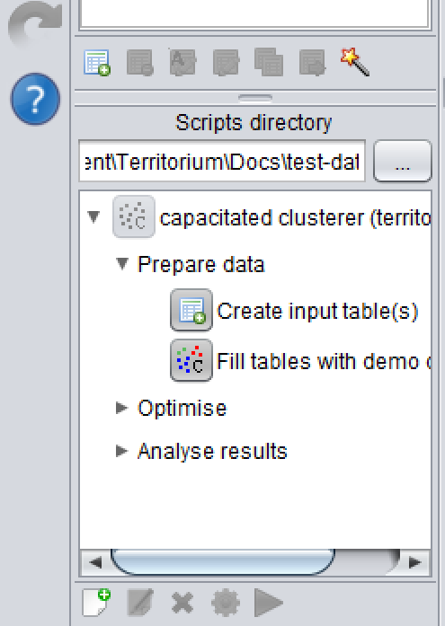
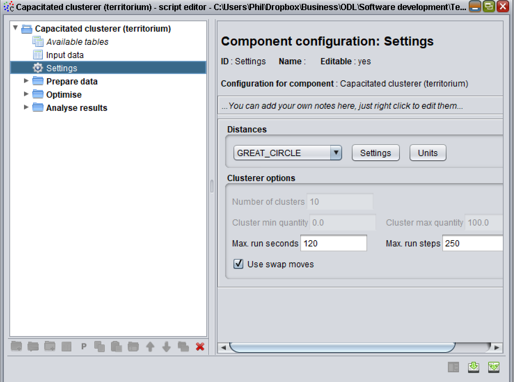
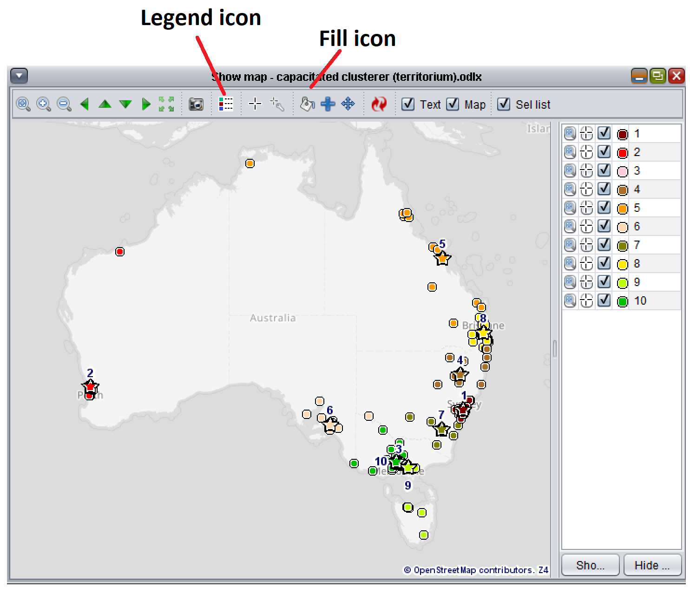

Copyrights
==========

Copyright 2014-2017 Open Door Logistics Ltd

Licensed under the Apache License, Version 2.0 (the "License");
you may not use this file except in compliance with the License.
You may obtain a copy of the License at

     http://www.apache.org/licenses/LICENSE-2.0

Unless required by applicable law or agreed to in writing, software
distributed under the License is distributed on an "AS IS" BASIS,
WITHOUT WARRANTIES OR CONDITIONS OF ANY KIND, either express or implied.
See the License for the specific language governing permissions and
limitations under the License.

Introduction
============

Territorium is an algorithm and module within ODL Studio for automatically assigning territories or clusters (we use the two terms interchangeably). It assigns based on minimising the travel cost from cluster centre to each assigned point and keeping the quantity for a cluster between a minimum and maximum value. Technically Territorium solves the "p-median site location problem" but with the added ability to define a minimum quantity as well (not included in the standard p-median definition). The Territorium algorithm / engine is also available as a standalone Java library, using Maven and released on the Apache open source licence.

Starting Territorium for ODL Studio
===================================

Start ODL Studio and select File, New to create a new empty Excel file. Use the wand icon in the toolbar below the tables panel to select "Capacitated Cluster (Territorium)". This launches the configure Territorium wizard. The wizard gives you four options:

1.  No controls setup, same params for each cluster

2.  No controls setup, separate params for each cluster

3.  Setup for points, same params for each cluster

4.  Setup for points, separate params for each cluster

If you are using Territorium to create territories using customer points (as opposed to postcode boundary polygons), you should select one of the options "Setup for points...", as they have preconfigured controls (for example, the map), designed for points-based territory creation. You can then choose between having the same parameters for each of your input clusters or different parameters. The input cluster parameters are values such as minimum and maximum quantity. When you select different parameters for each cluster, you define and fill an input clusters table in your Excel. In this walkthrough we will use points and select different parameters for each cluster, so choose the option "Setup for points, separate params for each cluster".

The ODL script window for Territorium will now appear (see Figure 1). Ensure you have no sheets / tables already present in your Excel spreadsheet when you create this script, or the script may inadvertently link itself to the wrong tables in your Excel.

Press the save icon on the bottom right of the script window. Save the script to your scripts directory and the options from the script should appear in your scripts panel, below the label "Scripts directory" (see Figure 2): Press the arrows to open up different options in the script. You can run an option by left-clicking on the picture to the left of its name.

Input data tables
=================

After creating the script, press the arrow to the left of "Prepare data" in the scripts panel, to view the options inside it. Then click the table icon to the left of "Create input tables", in the scripts panel. This creates two input tables in your spreadsheet. Now click the icon with multi-coloured points to the left of "Fill tables with demo data" to create some demo data. Demo data is available for several countries; choose your preferred country and select OK. You should now have example data in the Clusters and Customers tables to play with. We examine these two tables in the following sections.

Clusters table
--------------

The **Clusters** table has details of your input clusters. Typically each record would refer to a salesperson or technician who will be assigned a geographic area to work in. The clusters table has the following fields.

-   **id**. Choose a unique identifier for each input cluster record (e.g. 'John', 'Paul', 'George', 'Ringo').

-   **min-quantity**. The minimum quantity which should be assigned to that cluster, typically a measure of workload or potential sales.

-   **max-quantity**. The maximum quantity which should be assigned to that cluster.

-   **Target location fields**. You may want to optimise with cluster centres already being fixed (for example to your agents' homes or depot locations) and just assign customers to clusters based on these existing locations. Alternatively you may already have existing centres for territories and you are willing to move them a small amount to make them more efficient, but changing territories is disruptive so you don't want to move the centres too much. In these scenarios you want to define a target location and either (a) fix the cluster centre to the target location or (b) penalise the travel cost between the central customer in the cluster and your target. The following fields control this behaviour:

    -   *fix-to-target*. Fix the centre of the cluster used for cost calculations to the target centre instead of the most central customer. This has the effect of locking the cluster into place. Set this to *1* for fixed target and *0* for no fixed target. Alternatively if you enter *true*, *vrai*, *false* or *faux* it will be automatically converted into 1 or 0.

    -   *target-latitude*. The latitude of the target location, or empty if not set.

    -   *target-longitude*. The longitude of the target location, or empty if not set.

    -   *target-cost-distance*. A cost which is applied per unit distance between the cluster centre (most central customer) and the target location. This is used to keep a cluster near to an existing location but allow some flexibility. The cost is not used if *fix-to-target* is true (as it becomes irrelevant).

    -   *target-cost-time*. A cost which is applied per unit time between the cluster centre and the target location.

    -   *display-colour*. Colour to use for the cluster in the map. If left blank, a random colour is chosen based on the cluster id. You can enter hexadecimal colours into this field, for example \#ff0000 for red, \#00ff00 for green and \#0000ff for blue. See <http://www.color-hex.com> for example colours. Basic English name colours (e.g. red, black) will automatically be translated into hexadecimal colours.

Customers table
---------------

The customers table stores the list of customers to be assigned to clusters / territories. The fields in the Customers table are:

-   **id**. A unique id for each customer.

-   **latitude**. Customer latitude.

-   **longitude**. Customer longitude.

-   **quantity**. Quantity associated with each customer - for example your estimate of workload.

-   **cost-time**. Cost which is applied per unit time between the customer and the cluster centre.

-   **cost-distance**. Cost which is applied per unit distance between the customer and the cluster centre.

-   **cluster-id**. Id of the cluster (from the Clusters table) which gets filled in by the optimiser when your run it.

Running the optimiser
=====================

Now open up the options (by clicking on the arrow) inside "Optimise". You will see two options - "Start optimisation" and "Continue optimisation". Click "Start optimisation" and you will see a progress bar appear for a few seconds while the optimiser runs. If you double left-click on the "Customers" table name in the tables panel, you can see that the optimiser has now filled in the "cluster-id" field for each customer record. In the next sections we discuss the optimiser in detail and then inspect the results of running the optimiser.

Understanding the cost model
----------------------------

It is important to understand the model behind the optimiser. The optimiser minimises the total cost - also known as the objective function. The customers cost for a cluster is the sum of transport costs from each customer to the cluster centre. The transport cost for a customer is:

    cost_time x time_to_cluster_centre + cost_distance x distance_to_customer_centre

The cluster centre is either (a) the customer location within the cluster which minimises the total cluster customer cost (i.e. most central customer if the cost-time and cost-distance fields are the same for each customer). or (b) set as the target location, if this is fixed. If a target location is set, but not fixed, then a further cost - the target-cost - is added to the customer cost for a cluster. For a cluster the target cost is:

    target_cost_time x time_from_cluster_centre_to_target 
    + target_cost_distance x distance_from_cluster_centre_to_target 

The optimiser also minimises the quantity violation - the quantity outside of the accepted quantity range (min and max quantity) for each cluster. For a cluster, the quantity violation is defined as:

    max( 0 , quantity - max_quantity) + max(0, min_quantity - quantity)

So the objective function for the whole optimiser actually minimises the quantity violation first, then minimises the cost (technically this is called lexicographic ordering).

Optimiser configuration
-----------------------

Various options are available within the optimiser configuration. Double-click on the name of the script (usually "capacitated clusterer (Territorium)" in the scripts panel, or right click on it and select "Edit." This opens up the script editor window. Left click on "Settings" in the left of the script editor window, and the available optimiser settings should appear, as shown in Figure 3.

In the distances panel you can set the distances units and calculation method. The units are the ones used throughout Territorium, so if you set the time units to hours (the default) then the "target-cost-time" and "cost-time" fields are costs per hour. Similarly if you choose km for distances, the cost per unit distance fields are in km. The default distance calculation method is "Great circle" - which basically means a straight line (along the Earth) between two points. Typically you would want to change this to "Road network" and build a road network graph for your country, following the tutorial on our website.

If you want to run the optimiser for longer increase the "max run seconds" and "max run steps". You may want to set these to very large numbers - e.g. 9999999 - and just stop the optimiser using the "Stop early" button when you want to view the results. You can always continue the optimisation again from the current solution using the "Continue optimisation" option. So if, for example, you have a very large problem and you've been leaving it to optimise for 20 minutes, you can stop the optimisation using "Stop early", view the results and then restart using "Continue optimisation" without going back to the beginning of the optimisation (i.e. no optimisation time lost).

You are advised to keep the "Use swap moves" option turned on; generally you will get better solutions using this method although the optimiser may take longer to run.

Inspecting the result - map and reports
=======================================

After running the optimiser, click the arrow to open up the options under "Analyse results". Next click the "Show map" icon (this has a small picture of the Earth). You should see a map appear with coloured points for the country you selected in the demo data creator. The customer points are coloured by their assigned "cluster-id". In Figure 4 we have a map for customer assignment into sales territories for Australia.

Click on the legend icon at the top of the map control (white box with coloured squares - see the figure). The legend control on the right of the map lets you zoom on, select and show / hide customer points for each territory. See our tutorials on using the map within ODL Studio for more details on the map control.

If you press the fill icon (the paint bucket - see the figure) you can also manually adjust the territory. Press the icon to go into fill mode. In the panel which appears on the left, select the "cluster-id" field to fill. Then type in the new id for a cluster under "Set fill value". Left click and drag across the map to paint your territories. Remember you can always undo and redo any changes to the territories using the undo and redo buttons on the left-hand side of ODL Studio. The map - and any reports you have open - will automatically update when you make manual adjustments to territories. You can also make manual adjustments by double-clicking on the Customers table in the top-left tables panel, and then filling in the "cluster-id" field as you wish. Again the map and any open reports will automatically update.

Three different reports are also available under the "Analyse results" option:

1.  **Show customers report**. For each customer, this shows the travel time, distance and cost between the customer and its cluster's centre. It also shows the percentage of total cluster quantity coming from the customer.

2.  **Show clusters report**. For each cluster, this shows the number of customers, the total quantity, the total quantity violation (any violation - above the max or below the min - is shown as positive) and the latitude and longitude of the cluster centre. It also shows the total cost for the cluster, the totals of customer travel time, distance and cost, and the target location travel time, distance and cost (if set).

3.  **Show solution report**. This shows the number of clusters which were used and the number of assigned and unassigned customers. The optimiser will always assign all customers (providing you give it input clusters), however when you manually edit the data you could leave the "cluster-id" field for a customer blank, making it unassigned. We also show the total assigned quantity and quantity violation and the breakdowns of the various travel times, costs and distances.

If you want to save these report tables, click the icon for "Export report tables to spreadsheet" and the tables will be copied into the spreadsheet. Note the tables will not be automatically updated when they are saved in the spreadsheet, only the tables shown in the report controls are automatically updated when the data changes.

Using your own data
===================

To use your own data, start with the empty example spreadsheet created by the "Create input table(s)" function and enter your own data in the same format as the demo data. If you want to analyse travel times and quantity violations for an existing territory assignment without actually re-optimising or modifying the assignment, just fill in the "cluster-id" field yourself with the current assignment.

Advanced modelling strategies
=============================

You can use the min and max quantity fields to keep the quantity for each territory within your desired range. If this isn't possible with your data - for example you have a customer whose quantity exceeds the maximum quantity per cluster - the optimiser will do the best job possible to reduce this quantity violation. If you use a measure of work for the quantity, you can use this to ensure each territory has a minimum as well as maximum amount of work.

If you have customers that you visit frequently and customers that you seldom visit, you may want to set the cost-time or cost-distance for the frequently visited customers to be higher. This will favour territories centred on the customers you visit the most.

You can also - with some data manipulation - use Territorium for defining hierarchical territories (i.e. territories within territories - for example local sales people who are assigned to regional managers). The approach is suboptimal (i.e. may not get the absolute best solution) as we split it up into two separate problems, but is probably good enough for most circumstances. First you would create base level territories as discussed above. You would then use the clusters report to get the latitude and longitude of each of these "Level 0" clusters. Now create a new spreadsheet with empty Customers and Clusters tables. For each of your "Level 0" clusters, take the latitude and longitude and add a 'dummy' "Level 1" customer using the "Level 0" cluster latitude and longitude - *so the "Level 0" clusters become the "Level 1" customers*. Next create records in the Clusters table for your "Level 1" clusters, for example your regional sales managers (if optimising sales territories) or depots (if optimising technician work areas, where several technicians share a depot). Now fill in the quantities as desired and optimise to assign your "Level 0" clusters to "Level 1" clusters.
